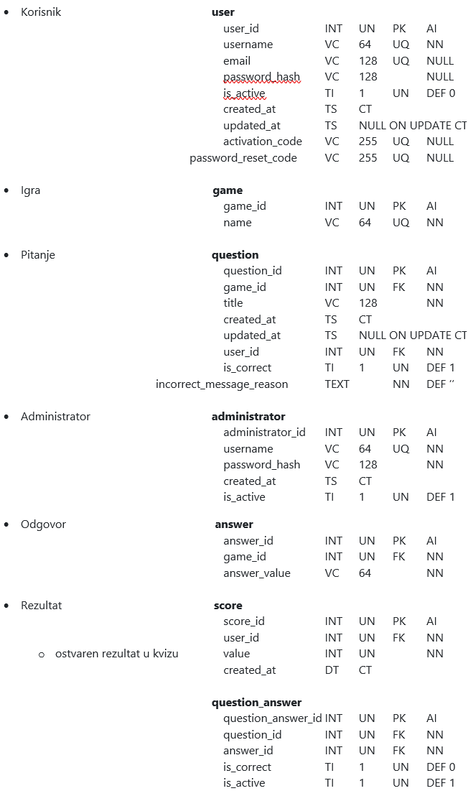
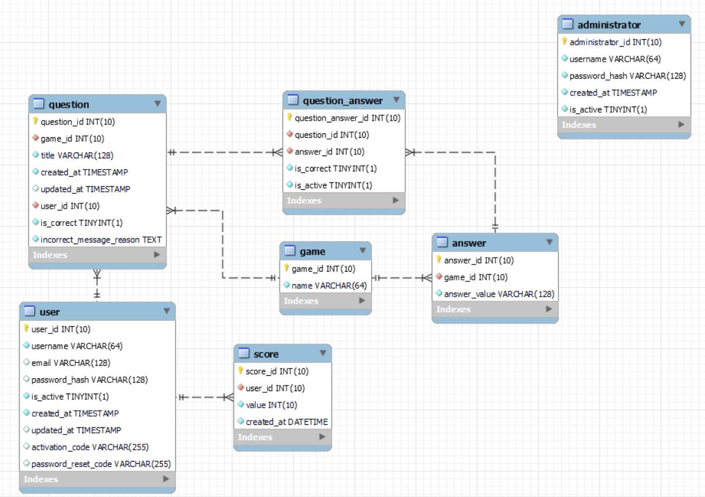

# Veb aplikacija za igre i kvizove

Ispitni zadatak iz predmeta Praktikum: Internet i veb tehnologije. Tema: **Veb aplikacija za igre i kvizove**

Ime i prezime: Miloš Jeknić
Broj indeksa: 2018201579
Školska godina: 2021/2022

## Projektni zahtevi

Aplikacija je namenjena za zabavu i proveru znanja. Registrovani i prijavljeni korisnici mogu da dodaju nova pitanja i izmene sadržaje u slučaju obeleženog pogrešnog odgovora. Korisnik koji želi da igra kviz ne mora da se registruje, ali je potrebno da upiše svoje korisničko ime prilikom pokretanja kviza. Prva igra koja se pokreće je generisanje reči od deset nasumično generisanih slova koju korisnik treba da upiše u tekstualno polje u roku od šezdeset sekundi. Reč treba biti što duža I za svako slovo se dobija jedan bod. Druga igra je pogađanje države sa zastavom. U navedenoj igri se prikaže zastava I u tekstualnom polju je potrebno da se upiše koja je država u pitanju. Korisnik ima deset sekundi vremena da pogodi koja je država u pitanju. Treća igra je pogađanje zastave za ime države. U navedenoj igri se prikaže naziv države I prikažu se tri ponuđene zastave. Korisnik treba da izabere koja je od navedenih zastava tačan odgovor. Korisnik ima deset sekundi vremena da pogodi koja je zastava tačan odgovor. Četvrta igra je pogađanje matematičkih pitanja. Korisnik ima trideset sekundi vremena da pogodi tačan odgovor. U ovoj igri korisnik bira koji je rezultat tačan za izraz koji se nalazi u pitanju. Omogućiti responsive dizajn, tako da stranice za kviz moraju biti responsive. Stranice za dodavanje pitanja I izmenu ne moraju biti responsive.

## Tehnička ograničenja

- Aplikacija mora da bude realizovana na Node.js platformi korišćenjem Express biblioteke. Aplikacija mora da bude podeljena u dve nezavisne celine: back-end veb servis (API) i front-end (GUI aplikacija). Sav kôd aplikacije treba da bude organizovan u jednom Git spremištu u okviru korisničkog naloga za ovaj projekat, sa podelom kao u primeru zadatka sa vežbi.
- Baza podataka mora da bude relaciona i treba koristiti MySQL ili MariaDB sistem za upravljanje bazama podataka (RDBMS) i u spremištu back-end dela aplikacije mora da bude dostupan SQL dump strukture baze podataka, eventualno sa inicijalnim podacima, potrebnim za demonstraciju rada projekta.
- Back-end i front-end delovi projekta moraju da budi pisani na TypeScript jeziku, prevedeni TypeScript prevodiocem na adekvatan JavaScript. Back-end deo aplikacije, preveden na JavaScript iz izvornog TypeScript koda se pokreće kao Node.js aplikacija, a front-end deo se statički servira sa rute statičkih resursa back-end dela aplikacije i izvršava se na strani klijenta. Za postupak provere identiteta korisnika koji upućuje zahteve back-end delu aplikacije može da se koristi mehanizam sesija ili JWT (JSON Web Tokena), po slobodnom izboru.
- Sav generisani HTML kôd koji proizvodi front-end deo aplikacije mora da bude 100% validan, tj. da prođe proveru W3C Validatorom (dopuštena su upozorenja - Warning, ali ne i greške - Error). Grafički korisnički interfejs se generiše na strani klijenta (client side rendering), korišćenjem React biblioteke, dok podatke doprema asinhrono iz back-end dela aplikacije (iz API-ja). Nije neophodno baviti se izradom posebnog dizajna grafičkog interfejsa aplikacije, već je moguće koristiti CSS biblioteke kao što je Bootstrap CSS biblioteka. Front-end deo aplikacije treba da bude realizovan tako da se prilagođava različitim veličinama ekrana (responsive design).
- Potrebno je obezbediti proveru podataka koji se od korisnika iz front-end dela upućuju back-end delu aplikacije. Moguća su tri sloja zaštite i to: (1) JavaScript validacija vrednosti na front-end-u; (2) Provera korišćenjem adekvatnih testova ili regularnih izraza na strani servera u back-end-u (moguće je i korišćenjem izričitih šema - Schema za validaciju ili drugim pristupima) i (3) provera na nivou baze podataka korišćenjem okidača nad samim tabelama baze podataka.
- Neophodno je napisati prateću projektnu dokumentaciju o izradi aplikacije koja sadrži (1) model baze podataka sa detaljnim opisom svih tabela, njihovih polja i relacija; (2) dijagram baze podataka; (3) dijagram organizacije delova sistema, gde se vidi veza između baze, back-end, front-end i korisnika sa opisom smera kretanja informacija; (4) popis svih aktivnosti koje su podržane kroz aplikaciju za sve uloge korisnika aplikacije prikazane u obliku Use-Case dijagrama; kao i (5) sve ostale elemente dokumentacije predviđene uputstvom za izradu dokumentacije po ISO standardu.
- Izrada oba dela aplikacije (projekata) i promene kodova datoteka tih projekata moraju da bude praćene korišćenjem alata za verziranje koda Git, a kompletan kôd aplikacije bude dostupan na javnom Git spremištu, npr. na besplatnim GitHub ili Bitbucket servisima, jedno spremište za back-end projekat i jedno za front-end projekat. Ne može ceo projekat da bude otpremljen u samo nekoliko masovnih Git commit-a, već mora da bude pokazano da je projekat realizovan u kontinuitetu, da su korišćene grane (branching), da je bilo paralelnog rada u više grana koje su spojene (merging) sa ili bez konflikata (conflict resolution).

## Pristupni parametri

### Za administratora

username: administrator, password: Cista lozinka koja se Vidi 1234

### Za korisnika

username: new-user, password: NewPassword12345

## Baza podataka

### Model baze podataka

### Dijagram baze podataka

### Uloge u veb-aplikaciji, prikazane kroz Use-case dijagram

### Uloge

### Administrator

- Uređivanje pitanja:

  - Dodavanje novog pitanja
  - Izmena postojećih pitanja
  - Pregled svih postojećih pitanja
  - Brisanje postojećih pitanja

- Uređivanje odgovora:

  - Dodavanje novog odgovora
  - Izmena postojećih odgovora
  - Pregled svih postojećih odgovora
  - Brisanje postojećih odgovora

- Uređivanje administratora:

  - Dodavanje novog administratora
  - Izmena postojećih administratora
  - Pregled svih postojećih administratora
  - Deaktiviranje naloga administratora

- Uređivanje korisnika:

  - Izmena postojećih korisnika
    - Izmena korisničkog imena
    - Izmena lozinke
  - Pregled svih postojećih korisnika
  - Deaktiviranje korisnika
  - Brisanje postojećih korisnika

- Odjava

#### "Neaktivni" korisnik

- Igranje kviza
- Prijava netačnih pitanja
- Registracija naloga sa pristupnim parametrima, čime postaje korisnik
- Odjava

#### Korisnik

- Igranje kviza
- Prijava netačnih pitanja
- Prijava naloga

- Uređivanje pitanja:

  - Dodavanje novog pitanja
  - Izmena postojećih pitanja
  - Pregled svih postojećih pitanja
  - Brisanje postojećih pitanja

- Pregled:

  - svojih rezultata
  - najboljih rezultata

- Izmena svojih podataka
- Odjava

#### Posetilac

- Logovanje
  - kao administrator
  - kao korisnik
